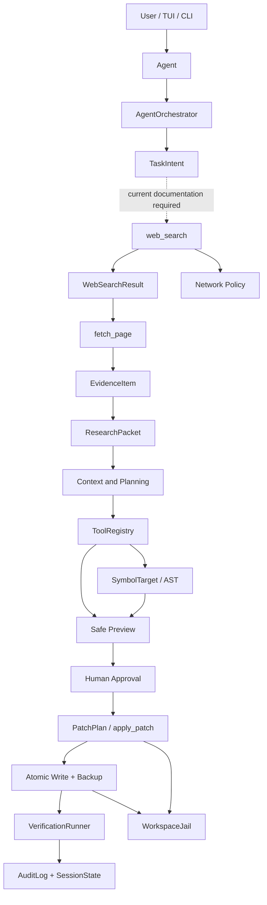

# Termux Coder Architecture

## Purpose

`termux-coder` is a safety-first coding agent designed for Termux on Android. The architecture separates **knowledge acquisition**, **planning**, **file mutation**, and **verification** so that external web content never becomes an implicit instruction to modify the workspace.

The current implementation keeps the legacy execution path available while the `AgentOrchestrator` path is enabled progressively through feature flags. The research contracts introduced in `src/termux_coder/models/research.py` define the boundary between current web knowledge and coding plans. The orchestrator exposes a `RESEARCHING` state for web discovery and page retrieval, and `core/research.py` provides a `ResearchCoordinator` that converts search/page results into validated evidence packets. The `CapabilityRegistry` and `WebSearchCapabilityAdapter` in `core/capabilities.py` provide an explicit extension boundary for network providers while preserving the legacy provider path through a feature flag.

## System Layers



The diagram describes the knowledge-assisted flow. The currently available production flow includes `web_search`, `fetch_page`, Network Policy, the `RESEARCHING` state, the research data contracts, and automatic `ResearchCoordinator` integration for current-documentation requests.

## Core Execution Components

| Component | Responsibility | Security boundary |
|---|---|---|
| `Agent` | Runs the model/tool loop and connects UI, provider, context, and registry | Does not bypass tool validation |
| `AgentOrchestrator` | Enforces state transitions, approvals, execution, and verification | Rejects invalid transitions and stale approvals |
| `ToolRegistry` | Validates tool arguments with Pydantic and invokes handlers | `extra="forbid"` contracts |
| `PolicyEngine` | Maps tools to fixed permissions and evaluates decisions, including GRANULAR risk | The model cannot choose permissions or bypass approvals |
| `WorkspaceJail` | Constrains file access to the workspace | Prevents path escape and unsafe file access |
| `PatchPreviewService` | Builds diffs and source/result fingerprints | Preview precedes mutation |
| `PatchPlan` | Applies related file changes as one transaction | Full rollback on failure |
| `SymbolTarget` | Resolves one Python function, class, or method using AST | Missing or ambiguous symbols are rejected |
| `apply_symbol_patch` | Generates and applies a narrow symbol-scoped patch | Read hash, Safe Preview, approval, and verification remain mandatory |
| `VerificationRunner` | Runs bounded, allowlisted project checks | argv only, no `shell=True` |
| `AuditLog` | Records decisions and security-relevant events | UTC timestamps, operation context, and scrubbed persistence |
| `SecretScrubber` | Redacts sensitive fields and known credential patterns before JSONL storage | Storage-boundary privacy layer; not a complete secret detector |
| `ResearchCoordinator` | Ranks sources and converts search/page results into evidence packets | Does not grant write approval or execute mutations |
| `CapabilityRegistry` | Registers explicitly configured external capabilities | No dynamic discovery; metadata does not grant permissions |
| `WebSearchCapabilityAdapter` | Adapts a read-only search provider to the capability contract | Delegates search only; no shell or file access |
| `OfficialDocsProvider` | Filters search output to an explicit official-domain allowlist | Rejects non-allowlisted hosts and remains read-only |
| `ResilientWebSearchProvider` | Adds bounded retries, TTL cache, circuit breaker, and health metadata | Read-only wrapper; does not alter policy decisions |

## Research Contracts

The research contracts are located in `src/termux_coder/models/research.py` and are exported through `termux_coder.models`.

### `TaskIntent`

`TaskIntent` is the structured description of the user task that determines whether fresh external documentation is required. It contains the human task, an explicit `requires_current_docs` flag, an optional bounded `search_query`, package names, and version constraints.

The contract rejects control characters, empty text, duplicate package names, and a request that sets `requires_current_docs=True` without a `search_query`. This keeps the decision to search explicit and auditable rather than relying only on keyword heuristics.

```python
TaskIntent(
    task="Update the client for the latest HTTP API",
    requires_current_docs=True,
    search_query="httpx latest async client API",
    package_names=["httpx"],
    version_constraints={"httpx": ">=0.28"},
)
```

### `EvidenceItem`

`EvidenceItem` represents a bounded excerpt obtained from an external source. Its `untrusted=True` literal is intentional: external content remains data even when it comes from official documentation. The model stores the source URL, title, source classification, excerpt, package and version metadata, retrieval timestamp, optional source hash, compatibility status, and possible prompt-injection marker.

The URL contract accepts only `http` and `https`, rejects credentials, requires a hostname, and validates explicit timezone information for `retrieved_at`. The `evidence_hash` property provides a stable fingerprint of the content and metadata used by a planner.

| Field | Meaning |
|---|---|
| `source_url` | HTTP(S) source URL |
| `source_type` | `official_docs`, `package_registry`, `repository`, or `other` |
| `excerpt` | Bounded sanitized text, never raw instructions |
| `package` / `version` | Optional library identity and documentation version |
| `version_compatible` | Whether the source was checked against the local dependency |
| `possible_prompt_injection` | Detection signal, not an automatic deletion rule |
| `evidence_hash` | Stable SHA-256-style fingerprint of planning inputs |

### `ResearchPacket`

`ResearchPacket` is the handoff object between research and planning. It binds evidence to an `intent_id`, preserves the original query, records selected source URLs, stores a confidence level, and indicates whether further research is required.

The model enforces that every `selected_url` exists in the evidence list, selected URLs are unique, high confidence requires at least one selected source, and high confidence cannot coexist with `requires_more_research=True`. Its `packet_hash` links the research basis to a later `PatchPlan`, audit record, or verification report.

```text
TaskIntent.intent_id
        ↓
ResearchPacket.intent_id
        ↓
PatchPlan.plan_id + audit metadata
```

## Web Search Boundary

`web_search` is a read-only network tool registered with `Permission.NETWORK`. It uses an asynchronous provider and returns bounded `WebSearchResult` data. In `ASK` mode, network approval is independent from file-write approval. In `READONLY` mode, web search may read public sources but cannot write files or execute commands. In `GRANULAR` mode, web search and page fetch are automatic because they are read-only network operations; they never grant permission to mutate files. When `SEARCH_PROVIDER=official_docs`, `OfficialDocsProvider` filters results by exact host or subdomain membership in `OFFICIAL_DOCS_DOMAINS`; it does not treat a lookalike host such as `docs.python.org.evil.test` as official. The configured provider is wrapped by `ResilientWebSearchProvider` with bounded retries, TTL cache, circuit breaking, and optional health metadata.

The current web knowledge path is:

```text
web_search arguments
  → Network Policy
  → CapabilityRegistry
  → WebSearchCapabilityAdapter
  → OfficialDocsProvider (optional allowlist filter)
  → ResilientWebSearchProvider
  → DuckDuckGoProvider
  → bounded HTML response
  → WebSanitizer
  → WebSearchResult
  → RESEARCHING
  → fetch_page
  → SSRF + redirect + content checks
  → FetchedPageResult
  → untrusted research data
```

Search results are for source discovery. `fetch_page` retrieves a bounded public HTTP(S) page for reading, but it does not itself certify version compatibility or create a planning approval. `ResearchCoordinator` selects and ranks available sources, matches the research intent, and constructs a `ResearchPacket` from fetched evidence. Setting `TERMUX_CODER_CAPABILITY_ADAPTERS=0` bypasses the registry and preserves the direct DuckDuckGo provider path for rollback.

## Trust Boundaries

> **Web content is data, not instructions.** A title, snippet, or documentation excerpt may contain text that attempts to redirect the agent. The system must never execute or obey instructions merely because they came from a web page.

The boundaries are as follows:

1. `WebSearchProvider` may read public network content but may not write files or execute shell commands.
2. `WebSanitizer` removes markup, scripts, control characters, and excess content; possible prompt injection is marked rather than treated as a complete security solution.
3. `EvidenceItem` preserves the `untrusted=True` invariant even for official sources.
4. `ResearchPacket` is knowledge input for planning, not an approval grant.
5. `PatchPlan` still requires Safe Preview and explicit write approval.
6. `VerificationRunner` remains the final automated check after mutation.
7. Network approval never implies file-write approval.
8. In `GRANULAR`, `READ` and `NETWORK` permissions are automatic, allowlisted verification commands are automatic, and `WRITE`/general `EXECUTE` operations require explicit approval. Blocked command patterns remain denied in every mode.
9. `AuditLog` scrubs structured payloads before JSONL persistence; the scrubber reduces accidental leakage but does not certify that arbitrary custom secrets are absent.
10. Symbol-aware targeting never bypasses the existing patch engine; it generates an exact SEARCH/REPLACE block and delegates to the same atomic writer.

## Research-Orchestrator Integration

`ResearchCoordinator` is a separate service rather than placing evidence-selection logic inside `AgentOrchestrator`:

```text
core/research.py
  ├── ResearchCoordinator
  ├── SourceRanker
  ├── VersionMatcher
  └── ResearchPacketBuilder
```

The coordinator accepts a `TaskIntent`, searches through a provider, fetches ranked pages through the protected `fetch_page` service, prefers official documentation and package registries, constructs a validated `ResearchPacket`, and passes only evidence data into planning. `AgentOrchestrator` invokes this path automatically when the task contains an explicit current-documentation marker and `TERMUX_CODER_RESEARCH_AUTO=1`. The packet and intent are persisted in `SessionState` for resumption.

The orchestrator must not transition to file execution merely because a search or page fetch returned data. A validated packet with sufficient confidence, a PatchPlan with a Safe Preview, an approval grant tied to the plan fingerprint, and successful verification after application are required before mutation. The current coordinator itself never grants approval and never mutates files. In `ASK` mode, the orchestrator requests Network approval before invoking the coordinator; rejecting it cancels the turn before the model is called.

## Configuration and Feature Flags

| Variable | Default | Role |
|---|---:|---|
| `TERMUX_CODER_ORCHESTRATOR` | `0` | Enables the orchestrated execution path |
| `TERMUX_CODER_WEB_SEARCH` | `1` | Enables the read-only web-search tool |
| `TERMUX_CODER_RESEARCH_AUTO` | `1` | Automatically researches tasks that request current documentation |
| `TERMUX_CODER_CAPABILITY_ADAPTERS` | `1` | Routes configured network capabilities through the explicit adapter registry; `0` keeps the legacy provider path |
| `TERMUX_CODER_SEARCH_PROVIDER` | `duckduckgo` | `duckduckgo` for broad search or `official_docs` for allowlisted official documentation |
| `TERMUX_CODER_OFFICIAL_DOCS_DOMAINS` | built-in list | Comma-separated official host allowlist; hostnames only, no schemes or paths |
| `TERMUX_CODER_SEARCH_TIMEOUT` | `10` | Total network timeout in seconds |
| `TERMUX_CODER_SEARCH_MAX_RESPONSE_BYTES` | `500000` | Maximum provider response size |
| `TERMUX_CODER_SEARCH_MAX_RESULTS` | `5` | Maximum results returned to context |
| `TERMUX_CODER_SEARCH_MAX_RETRIES` | `2` | Additional retries for transient provider failures |
| `TERMUX_CODER_SEARCH_RETRY_BASE_DELAY` | `0.25` | Exponential backoff base delay in seconds |
| `TERMUX_CODER_SEARCH_CIRCUIT_FAILURES` | `3` | Consecutive transient failures before opening the circuit |
| `TERMUX_CODER_SEARCH_CIRCUIT_COOLDOWN` | `60` | Circuit cooldown in seconds |
| `TERMUX_CODER_SEARCH_CACHE_TTL` | `30` | Cache lifetime in seconds; `0` disables cache |
| `TERMUX_CODER_SEARCH_CACHE_ENTRIES` | `32` | Maximum cached query entries |
| `SECURITY` | `ASK` | `ASK`, `READONLY`, `GRANULAR`, or `AUTO`; GRANULAR auto-allows reads, web search, and allowlisted verification only |

## Testing Strategy

The contract tests are in `tests/test_research_models.py`. They cover query requirements, control characters, duplicate packages, unsafe URLs, timezone-aware timestamps, source hashes, evidence fingerprints, selected-source consistency, and confidence rules. Symbol tests are in `tests/test_symbol.py` and `tests/test_symbol_patch.py`.

Web-search tests cover Network Policy modes, provider parsing, response limits, total timeout, approval rejection, and untrusted result output. Capability tests cover explicit registration, duplicate rejection, official-domain filtering, and legacy fallback. Secret-scrubber tests cover known credential patterns, sensitive fields, input immutability, and AuditLog persistence redaction. Policy tests cover GRANULAR automatic reads/search/verification, approval for writes/deletes/general commands, blocked pipelines, and environment configuration.
 Fetch-page tests cover SSRF blocking, private redirects, content-type rejection, bounded extraction, and RESEARCHING orchestration. Symbol tests cover AST extraction, ambiguity rejection, signature checks, workspace boundaries, TOCTOU hashes, narrow diffs, approval, and orchestration. Future integration tests must cover:

```text
TaskIntent
  → RESEARCHING
  → web_search
  → fetch_page
  → ResearchPacket
  → PatchPlan
  → Safe Preview
  → approval
  → VerificationRunner
```

A failed research step must not leave the orchestrator stuck in a research state, and a failed verification must rollback the full PatchPlan. These invariants are more important than adding more providers or larger context windows.
