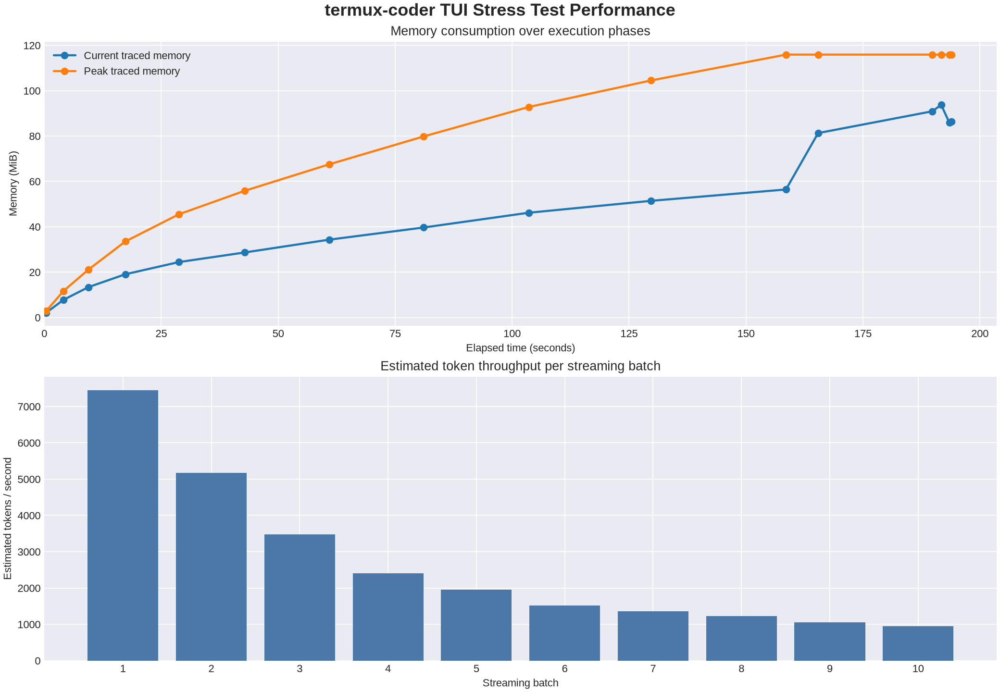
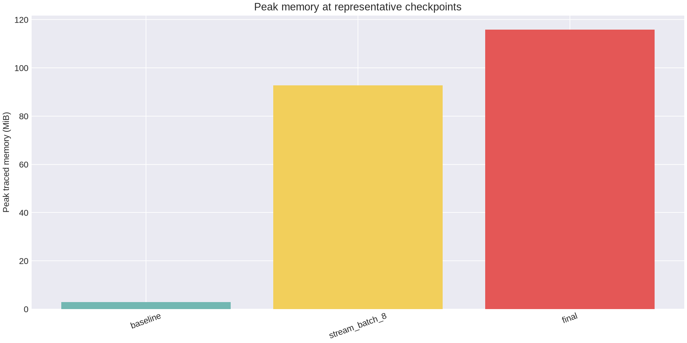

# termux-coder TUI Stress-Test Performance Report

## Executive summary

This report visualizes a real stress run of the `termux-coder` TUI. The run injected **25,000 streaming chunks**, **1,000 tool events**, and **600 assistant messages** into a 122×39 virtual terminal while measuring wall-clock time with `time.perf_counter()` and Python allocation behavior with `tracemalloc`.

The run completed without errors. It processed **275,000 estimated tokens**, reached a **115.89 MiB traced-memory peak**, and ended at **86.42 MiB current traced memory**. Virtualization preserved the complete 600-record conversation while keeping the rendered message window bounded by the configured limit of 160 widgets.

> The token count is an estimate based on the same lightweight `len(chunk) // 4` approximation used by the current TUI token counter. It is not a provider tokenizer measurement.

## Visual overview



The overview chart shows two different behaviors. Traced memory rises progressively during streaming and reaches its maximum during the streaming phase. The token-throughput bars decline across successive batches because the stress run is measuring UI work, rendering, and event-loop scheduling rather than raw model generation speed.



The checkpoint chart highlights the increase from the baseline to the streaming and final stages. The later reduction in current memory after navigation is consistent with Virtualization removing and rebuilding only a bounded subset of rendered widgets; the cumulative peak remains a historical maximum for the run.

## Workload and final measurements

| Metric | Measured value |
|---|---:|
| Virtual terminal size | 122×39 |
| Streaming chunks | 25,000 |
| Estimated tokens per chunk | 11 |
| Estimated tokens processed | 275,000 |
| Tool events | 1,000 |
| Assistant messages | 600 |
| Total elapsed time | 193.929 s |
| Current traced memory at end | 86.423 MiB |
| Peak traced memory | 115.886 MiB |
| Message records retained | 600 |
| Rendered widgets at end | 13 |
| Virtualization limit | 160 |
| Navigation render batch | 24 |

## Streaming measurements

| Phase | Elapsed time (s) | Estimated tokens | Current memory (MiB) | Peak memory (MiB) |
|---|---:|---:|---:|---:|
| Baseline | 0.406 | 0 | 2.109 | 2.880 |
| Stream batch 1 | 4.099 | 27,500 | 7.775 | 11.663 |
| Stream batch 2 | 9.417 | 55,000 | 13.367 | 21.083 |
| Stream batch 3 | 17.317 | 82,500 | 19.046 | 33.505 |
| Stream batch 4 | 28.748 | 110,000 | 24.416 | 45.476 |
| Stream batch 5 | 42.820 | 137,500 | 28.651 | 55.841 |
| Stream batch 6 | 60.887 | 165,000 | 34.299 | 67.516 |
| Stream batch 7 | 81.083 | 192,500 | 39.668 | 79.815 |
| Stream batch 8 | 103.571 | 220,000 | 46.177 | 92.809 |
| Stream batch 9 | 129.637 | 247,500 | 51.413 | 104.484 |
| Stream batch 10 | 158.537 | 275,000 | 56.427 | 115.886 |

The measured estimated token throughput ranged from **951.55 to 7,446.94 tokens/second**, with a mean of **2,657.21 tokens/second** across the ten streaming intervals. The first interval is faster because the UI has not yet accumulated the same rendering and allocation workload; later intervals are more representative of sustained pressure.

## Post-stream workload and navigation

| Phase | Elapsed time (s) | Current memory (MiB) | Peak memory (MiB) |
|---|---:|---:|---:|
| After 1,000 tool events | 165.411 | 81.294 | 115.886 |
| After 600 assistant messages | 189.849 | 90.911 | 115.886 |
| After first-message navigation | 191.715 | 93.774 | 115.886 |
| After last-message navigation | 193.453 | 85.927 | 115.886 |
| Final | 193.929 | 86.423 | 115.886 |

The important correctness result is that navigation did not delete conversation records. All 600 `MessageRecord` objects remained available while only a bounded subset of Widgets was materialized. The current-memory decrease after the last navigation also confirms that rendered objects are being evicted and rebuilt rather than retaining every visual object permanently.

## Interpretation and limitations

The measurements describe Python allocation behavior observed by `tracemalloc`; they are not the complete resident-set size of the Python process or Android application. Consequently, the memory values should be used for regression comparison under the same harness, not as a direct estimate of total phone RAM consumption.

The stress run was executed in the sandbox using a virtual terminal and a synthetic event source. It did not contact a model provider or measure network latency. For a phone-specific baseline, run the same collector in Termux on the target device and compare the resulting JSON using the same workload and terminal dimensions.

## Reproducibility

The raw measurement data is available in [`tui_performance_data.json`](tui_performance_data.json), and the derived analysis is in [`tui_performance_analysis.json`](tui_performance_analysis.json). The collection and rendering scripts are:

```text
scripts/collect_tui_performance_data.py
scripts/render_tui_performance_report.py
```

The previously committed stress harness remains available at:

```text
scripts/tui_stress_test.py
```
